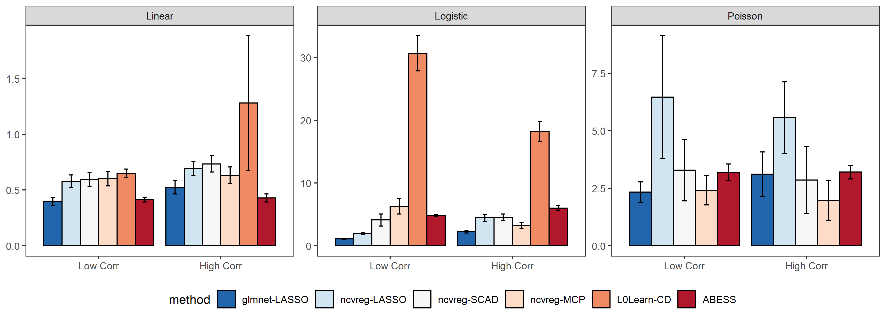

# abess: An R package for Best-Subset Selection in Polynomial Time </a>

<!-- badges: start -->
[](https://github.com/abess-team/abess/actions)
[](https://codecov.io/gh/abess-team/abess)
[](https://cran.r-project.org/package=abess)
[](http://www.gnu.org/licenses/gpl-3.0)
[](https://www.codacy.com/gh/abess-team/abess/dashboard?utm_source=github.com&amp;utm_medium=referral&amp;utm_content=abess-team/abess&amp;utm_campaign=Badge_Grade)
<!-- badges: end -->

Best-subset selection aims to find a small subset of predictors such that the resulting linear model is expected to have the most desirable prediction accuracy. This project implements a polynomial algorithm proposed by Zhu et al (2020) to solve the problem. It supports:
<!-- Moreover, the softwares includes helpful features for high-dimensional data analysis. -->

- various model:
  - linear regression
  - classification (binary or multi-class)
  - counting-response modeling
  - censored-response modeling
  - multi-response modeling (multi-tasks learning)
- sure independence screening
- nuisance penalized regression

## Installation

To install the Ball R package from CRAN, just run:

``` r
install.packages("abess")
```

Alternative, you can install the newest version of abess from [github](https://github.com/) with:

``` r
remotes::install_github("abess-team/abess")
```

## Performance

To show the computational efficiency of abess, 
we compare abess R package with popular R libraries: glmnet, ncvreg, picasso for linear, logistic and poisson regressions; 
Timings of the CPU execution are recorded in seconds and averaged over 100 replications on a sequence
of 100 regularization parameters.

<!-- The designed matrix is formed by i.i.d sample generated from a multivariate normal distribution with mean 0 and covariance matrix $\Sigma = (\sigma_{ij})$. We consider two settings—low correlation and high correlation. For the low correlation scenario, we set $\sigma_{ij} = 0.1^{|i-j|}$ and for the high correlation $\sigma_{ij} = 0.7$. The number of predictors is 1000. The true coefficient $\beta^*$ is a vector with 10 nonzero entries uniformly distributed in $[b,B]$. We set $b=5\sqrt{2\log(p)/n}$, $B = 100b$ for linear regression $b = 10\sqrt{2\log(p)/n}$, $B = 5*b$ for logistic regression and $b = -10 \sqrt{2  \log(p) / n}$, $B=10 \sqrt{2 \log(p) / n}$ for poisson regression. A random noise generated from a standard Gaussian distribution is added to the linear predictor $x^\prime\beta$ for linear regression. The size of training data is 500. -->
All experiments are
evaluated on an Intel(R) Xeon(R) CPU E5-2620 v4 @ 2.10GHz and under R version 3.6.1. 

```r
source("R-package/example/timing.R")
```

Results are presented in the following picture. As a package solving the best subset selection, abess reaches a high efficient performance especially in linear regression where it gives the fastest solution.



## Citation
If you use **abess** package or reference our examples in a presentation or publication, we would appreciate citations of our package.

## Reference
A polynomial algorithm for best-subset selection problem. Junxian Zhu, Canhong Wen, Jin Zhu, Heping Zhang, Xueqin Wang. Proceedings of the National Academy of Sciences Dec 2020, 117 (52) 33117-33123; DOI: 10.1073/pnas.2014241117    
Fan, J. and Lv, J. (2008), Sure independence screening for ultrahigh dimensional feature space. Journal of the Royal Statistical Society: Series B (Statistical Methodology), 70: 849-911. https://doi.org/10.1111/j.1467-9868.2008.00674.x    
Qiang Sun & Heping Zhang (2020) Targeted Inference Involving High-Dimensional Data Using Nuisance Penalized Regression, Journal of the American Statistical Association, DOI: 10.1080/01621459.2020.1737079     
Zhang, Y., Zhu, J., Zhu, J. and Wang, X., 2021. Certifiably Polynomial Algorithm for Best Group Subset Selection. arXiv preprint arXiv:2104.12576.
