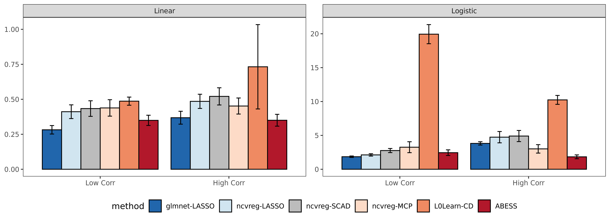

abess: A Fast Best-Subset Selection Library in Python & R 
</a>
---

[](https://github.com/abess-team/abess/actions)
[](https://codecov.io/gh/abess-team/abess)
[](https://abess.readthedocs.io/en/latest/?badge=latest)
[](https://cran.r-project.org/package=abess)
[](https://badge.fury.io/py/abess)
[](https://img.shields.io/pypi/pyversions/abess)
[](http://www.gnu.org/licenses/gpl-3.0)
[](https://www.codacy.com/gh/abess-team/abess/dashboard?utm_source=github.com&amp;utm_medium=referral&amp;utm_content=abess-team/abess&amp;utm_campaign=Badge_Grade)
<!-- [](https://travis-ci.com/abess-team/abess) -->

## Overview
**abess** (Adaptive BEst Subset Selection) library aims to solve general best subset selection, i.e., 
find a small subset of predictors such that the resulting model is expected to have the highest accuracy. 
The selection for best subset shows great value in scientific researches and practical application. 
For example, clinicians wants to know whether a patient is health or not based on the expression level of a few of important genes.

This library implements a generic algorithm framework to find the optimal solution in an extremely fast way.
This framework now supports the detection of best subset under: 
[linear regression](https://abess.readthedocs.io/en/latest/Tutorial/LinearRegression.html),
[classification (binary or multi-class)](https://abess.readthedocs.io/en/latest/Tutorial/logi_and_multiclass.html),
[counting-response modeling](https://abess.readthedocs.io/en/latest/Tutorial/PoissonRegression.html),
[censored-response modeling](https://abess.readthedocs.io/en/latest/Tutorial/CoxRegression.html),
[multi-response modeling (multi-tasks learning)](https://abess.readthedocs.io/en/latest/Tutorial/MultiTaskLearning.html), etc.
It also supports the variants of best subset selection like 
[group best subset selection](https://abess.readthedocs.io/en/latest/Tutorial/advanced_features.html#Best-group-subset-selection),
[nuisance penalized regression](https://abess.readthedocs.io/en/latest/Tutorial/advanced_features.html#Nuisance-Regression),
Especially, the time complexity of (group) best subset selection for linear regression is certifiably polynomial.

## Quick start

The abess software has both Python and R's interfaces. Here a quick start will be given and
for more details, please view: [Installation](https://abess.readthedocs.io/en/latest/Installation.html).

### Python package

Install the stable version of Python-package from [Pypi](https://pypi.org/project/abess/) with:

```shell
$ pip install abess
```

Best subset selection for linear regression on a simulated dataset in Python:    

```python
from abess.linear import abessLm
from abess.datasets import make_glm_data
sim_dat = make_glm_data(n = 300, p = 1000, k = 10, family = "gaussian")
model = abessLm()
model.fit(sim_dat.x, sim_dat.y)
```


See more examples analyzed with Python in the [Python tutorials](https://abess.readthedocs.io/en/latest/Tutorial/index.html).


### R package

Install the stable version of R-package from [CRAN](https://cran.r-project.org/web/packages/abess) with:

```r
install.packages("abess")
```

Best subset selection for linear regression on a simulated dataset in R:

```r
library(abess)
sim_dat <- generate.data(n = 300, p = 1000)
abess(x = sim_dat[["x"]], y = sim_dat[["y"]])
```

See more examples analyzed with R in the [R tutorials](https://abess-team.github.io/abess/articles/).


## Runtime Performance

To show the power of abess in computation, we assess its timings of the CPU execution (seconds) on synthetic datasets, and compare to state-of-the-art variable selection methods. The variable selection and estimation results are deferred to [Python performance](https://abess.readthedocs.io/en/latest/Tutorial/power_of_abess.html) and [R performance](https://abess-team.github.io/abess/articles/v11-power-of-abess.html).

### Python package   

We compare abess Python package with scikit-learn on linear and logistic regression.
Results are presented in the below figure, and can be reproduce by running the commands in shell:

```shell
$ python abess/docs/example/Python/timings.py
```

we obtain the runtime comparison picture:


### R packages

We compare abess R package with three widely used R packages: glmnet, ncvreg, L0Learn. 
Conducting the following commands in shell: 

```shell
$ Rscript abess/docs/example/R/timings.R
```

we obtain the runtime comparison picture:



Results are presented in the following picture. As a package solving the best subset selection, abess reaches a high efficient performance especially in linear regression where it gives the fastest solution.

In both Python and R environments, 
abess reaches a high efficient performance especially in linear regression where it gives the fastest solution.

## Open source software     

**abess** is a free software and its source code are publicly available in [Github](https://github.com/abess-team/abess).  
The core framework is programmed in C++, and user-friendly R and Python interfaces are offered.
You can redistribute it and/or modify it under the terms of the [GPL-v3 License](https://www.gnu.org/licenses/gpl-3.0.html). 
We welcome contributions for abess, especially stretching abess to the other best subset selection problems. 

## References

- Junxian Zhu, Canhong Wen, Jin Zhu, Heping Zhang, and Xueqin Wang (2020). A polynomial algorithm for best-subset selection problem. Proceedings of the National Academy of Sciences, 117(52):33117-33123.

- Pölsterl, S (2020). scikit-survival: A Library for Time-to-Event Analysis Built on Top of scikit-learn. J. Mach. Learn. Res., 21(212), 1-6.

- Yanhang Zhang, Junxian Zhu, Jin Zhu, and Xueqin Wang (2021). Certifiably Polynomial Algorithm for Best Group Subset Selection. arXiv preprint arXiv:2104.12576.

- Qiang Sun and Heping Zhang (2020). Targeted Inference Involving High-Dimensional Data Using Nuisance Penalized Regression, Journal of the American Statistical Association, DOI: 10.1080/01621459.2020.1737079.
